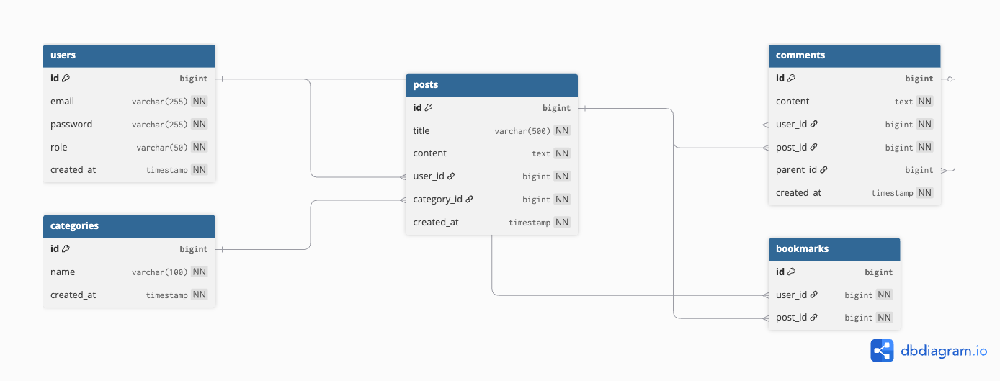
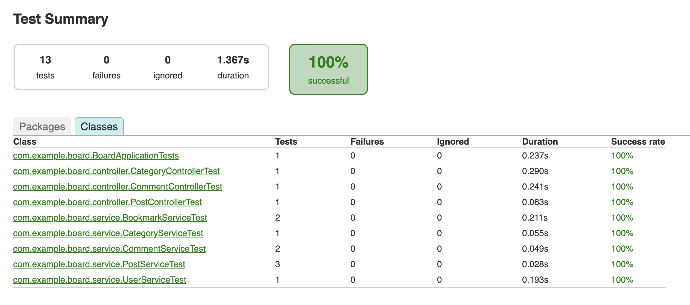
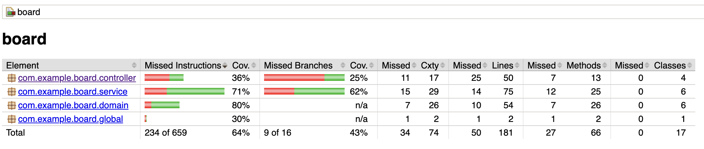

# 게시판 서비스 #1 - Database 설계 및 Spring Boot 웹 어플리케이션 서버 개발

## 📌 프로젝트 개요
Spring Boot와 Spring Security를 활용한 게시판 서비스 API 서버 개발 프로젝트입니다.

## 🎯 주요 기능

### 1. 인증 및 권한 관리
- **세션 기반 로그인**: Spring Security를 사용한 Form Login 방식
- **비밀번호 암호화**: BCrypt 암호화 방식 사용
- **권한 관리**: USER, ADMIN 두 가지 Role 구분
  - ADMIN만 Swagger API 문서에 접근 가능
  - 로그인한 사용자만 게시글/댓글 작성 가능
  - 자신이 작성한 글/댓글만 수정/삭제 가능

### 2. 게시글 관리
- 게시글 작성, 조회, 수정, 삭제 (CRUD)
- 카테고리별 게시글 분류
- 작성자 본인만 수정/삭제 가능

### 3. 댓글 및 대댓글
- 게시글에 댓글 작성
- 댓글에 대댓글 작성 (자기참조 관계)
- 계층형 댓글 구조 지원

### 4. 카테고리
- 동적 카테고리 추가
- 게시글에 카테고리 지정

### 5. 북마크
- 좋아하는 게시글 북마크 추가/취소 (토글 기능)
- 중복 북마크 방지

## 🗄️ ERD 설계

### 데이터베이스 스키마


### 주요 연관관계
1. **User (1) : Post (N)** - 한 사용자가 여러 게시글 작성
2. **Category (1) : Post (N)** - 한 카테고리에 여러 게시글
3. **User (1) : Comment (N)** - 한 사용자가 여러 댓글 작성
4. **Post (1) : Comment (N)** - 한 게시글에 여러 댓글
5. **Comment (1) : Comment (N)** - 댓글에 대댓글 (자기참조)
6. **User (M) : Post (N) through Bookmark** - 사용자와 게시글 다대다 관계 (북마크)

## 🏗️ 아키텍처 및 패키지 구조

### 계층형 아키텍처 (Layered Architecture)
```
Controller (Presentation Layer)
    ↓
Service (Business Logic Layer)
    ↓
Repository (Data Access Layer)
    ↓
Domain (Entity Layer)
```

### 패키지 구조
```
com.example.board
├── controller/          # REST API 엔드포인트 정의
│   ├── UserController
│   ├── PostController
│   ├── CommentController
│   ├── CategoryController
│   └── (BookmarkController - Service에서 직접 호출)
├── service/             # 비즈니스 로직 처리
│   ├── UserService
│   ├── PostService
│   ├── CommentService
│   ├── CategoryService
│   └── BookmarkService
├── repository/          # JPA Repository (데이터 접근)
│   ├── UserRepository
│   ├── PostRepository
│   ├── CommentRepository
│   ├── CategoryRepository
│   └── BookmarkRepository
├── domain/              # JPA 엔티티 (도메인 모델)
│   ├── User
│   ├── Post
│   ├── Comment
│   ├── Category
│   ├── Bookmark
│   └── Role (Enum)
├── dto/                 # 데이터 전송 객체
│   ├── UserCreateRequest
│   ├── PostRequestDto
│   ├── PostUpdateRequest
│   └── CommentCreateRequest
└── global/              # 전역 설정
    └── config/
        └── SecurityConfig
```

### 왜 이런 구조가 효율적인가?

#### 1. **관심사의 분리 (Separation of Concerns)**
- 각 계층이 명확한 책임을 가짐
- Controller는 HTTP 요청/응답만 담당
- Service는 비즈니스 로직만 담당
- Repository는 데이터 접근만 담당

#### 2. **유지보수성 향상**
- 특정 계층의 변경이 다른 계층에 영향을 최소화
- 예: DB를 H2에서 MySQL로 변경해도 Repository 계층은 수정 불필요

#### 3. **테스트 용이성**
- 각 계층을 독립적으로 테스트 가능
- Mock 객체를 사용한 단위 테스트 작성 용이
- Service 로직을 Controller와 분리하여 순수 비즈니스 로직 테스트 가능

#### 4. **재사용성**
- Service 로직은 다양한 Controller에서 재사용 가능
- 예: REST API, GraphQL, gRPC 등 다양한 인터페이스에서 동일한 Service 사용

#### 5. **확장성**
- 새로운 기능 추가 시 기존 코드 수정 최소화
- 새로운 Controller/Service/Repository 추가로 기능 확장

## 🔧 기술 스택
- **Java 17**
- **Spring Boot 3.x**
- **Spring Security** - 인증/인가
- **Spring Data JPA** - ORM
- **H2 Database** - 인메모리 DB (개발/테스트용)
- **JUnit 5** - 테스트 프레임워크
- **Mockito** - Mock 테스트
- **Gradle** - 빌드 도구
- **Lombok** - 보일러플레이트 코드 제거

## ✅ 테스트

### 테스트 전략
**BDD (Behavior-Driven Development)** 스타일의 **Given-When-Then** 패턴 사용

```java
@Test
@DisplayName("북마크 추가: 기존에 북마크가 없으면 새로 저장한다")
void toggleBookmark_Add() {
    // Given (준비: 테스트 데이터 및 Mock 동작 설정)
    Long userId = 1L;
    Long postId = 1L;
    given(userRepository.findById(userId)).willReturn(Optional.of(new User()));
    
    // When (실행: 테스트 대상 메서드 호출)
    bookmarkService.toggleBookmark(userId, postId);
    
    // Then (검증: 예상 결과 확인)
    verify(bookmarkRepository).save(any(Bookmark.class));
}
```

### 테스트 커버리지
- **Service 계층**: 모든 비즈니스 로직에 대한 단위 테스트
  - UserServiceTest
  - PostServiceTest
  - CommentServiceTest
  - CategoryServiceTest
  - BookmarkServiceTest
  
- **Controller 계층**: MockMvc를 사용한 API 테스트
  - PostControllerTest
  - CommentControllerTest
  - CategoryControllerTest

### 테스트 실행 방법
```bash
./gradlew test
```

### 테스트 커버리지 확인
```bash
./gradlew test jacocoTestReport
open build/reports/jacoco/test/html/index.html
```

## 🚀 실행 방법

### 1. 프로젝트 빌드
```bash
./gradlew build
```

### 2. 애플리케이션 실행
```bash
./gradlew bootRun
```

### 3. MySQL 데이터베이스 준비
```bash
# MySQL 설치 후 데이터베이스 생성
mysql -u root -p
CREATE DATABASE board;
```

**application.properties 설정**
```properties
spring.datasource.url=jdbc:mysql://localhost:3306/board?serverTimezone=Asia/Seoul
spring.datasource.username=root
spring.datasource.password=your_password
spring.jpa.hibernate.ddl-auto=update
```

### 4. API 테스트

#### 회원가입
```bash
curl -X POST http://localhost:8080/users/signup \
  -H "Content-Type: application/json" \
  -d '{"email":"user@test.com","password":"1234","role":"USER"}'
```

#### 로그인 (세션 저장)
```bash
curl -X POST http://localhost:8080/login \
  -d "username=user@test.com&password=1234" \
  -c cookie.txt
```

#### 카테고리 생성
```bash
curl -X POST "http://localhost:8080/categories?name=자유게시판" \
  -b cookie.txt
```

#### 게시글 작성
```bash
curl -X POST http://localhost:8080/posts \
  -H "Content-Type: application/json" \
  -b cookie.txt \
  -d '{"userId":1,"categoryId":1,"title":"제목","content":"내용"}'
```

## 📊 테스트 결과

### ✅ 단위 테스트 통과


**모든 테스트 통과 완료**
- **총 13개 테스트** 100% 성공
- **Service Layer:** 5개 테스트 클래스 (9개 테스트)
  - BookmarkServiceTest, CategoryServiceTest, CommentServiceTest, PostServiceTest, UserServiceTest
- **Controller Layer:** 3개 테스트 클래스 (3개 테스트)
  - CategoryControllerTest, CommentControllerTest, PostControllerTest
- **실행 시간:** 1.367초
- **실패 건수:** 0건

### 📈 테스트 커버리지 리포트


**커버리지 상세**
- **전체 커버리지:** 64% (234/659 instructions)
- **Service Layer:** 71% - 핵심 비즈니스 로직 테스트 완료
- **Domain Layer:** 80% - 도메인 모델 검증 완료 
- **Controller Layer:** 36% - 주요 API 엔드포인트 테스트 완료
- **Branch Coverage:** 43% (9/16)

## 🔐 보안 설정

### Spring Security 설정
- **CSRF**: 개발 편의를 위해 비활성화 (프로덕션에서는 활성화 필요)
- **폼 로그인**: 기본 로그인 페이지 제공
- **세션 방식**: 서버 세션으로 로그인 상태 유지
- **권한 관리**:
  - `/users/signup`, `/login` - 모두 접근 가능
  - `/swagger-ui/**`, `/v3/api-docs/**` - ADMIN만 접근 가능
  - 그 외 모든 경로 - 로그인 필수

## 📝 코드 리뷰 포인트

### 1. 도메인 주도 설계 (Domain-Driven Design)
- 엔티티 내부에 비즈니스 로직 캡슐화
- 예: `Post.update()` 메서드로 수정 로직 표현
- Setter 대신 명확한 의도를 가진 메서드 사용

### 2. 의존성 주입 (Dependency Injection)
- 생성자 주입 방식 사용 (권장 방식)
- `@RequiredArgsConstructor` (Lombok) 활용

### 3. 트랜잭션 관리
- `@Transactional` 어노테이션으로 트랜잭션 범위 명시
- 읽기 전용 트랜잭션 최적화: `@Transactional(readOnly = true)`

### 4. 예외 처리
- Repository에서 `Optional` 반환
- Service에서 `orElseThrow()`로 명시적 예외 처리

### 5. DTO 활용
- 엔티티를 직접 노출하지 않고 DTO로 변환
- API 요청/응답 스펙과 도메인 모델 분리

## 🎓 학습 내용 정리

### ERD 설계에서 배운 점
1. **정규화**: 중복 데이터 최소화
2. **연관관계 매핑**: JPA의 `@ManyToOne`, `@OneToMany` 이해
3. **자기참조 관계**: Comment의 parent_id로 대댓글 구현
4. **중간 테이블**: 북마크를 통한 다대다 관계 해소

### Spring Boot 개발에서 배운 점
1. **계층형 아키텍처**: 각 계층의 역할과 책임 분리
2. **Spring Security**: 인증/인가 프로세스 이해
3. **JPA 영속성 컨텍스트**: 엔티티 생명주기 관리
4. **테스트 전략**: Given-When-Then 패턴으로 명확한 테스트 작성

### 디자인 패턴 및 원칙
1. **단일 책임 원칙 (SRP)**: 각 클래스는 하나의 책임만
2. **의존성 역전 원칙 (DIP)**: 인터페이스(Repository)에 의존
3. **Service 패턴**: 비즈니스 로직 캡슐화
4. **DTO 패턴**: 계층 간 데이터 전달 객체